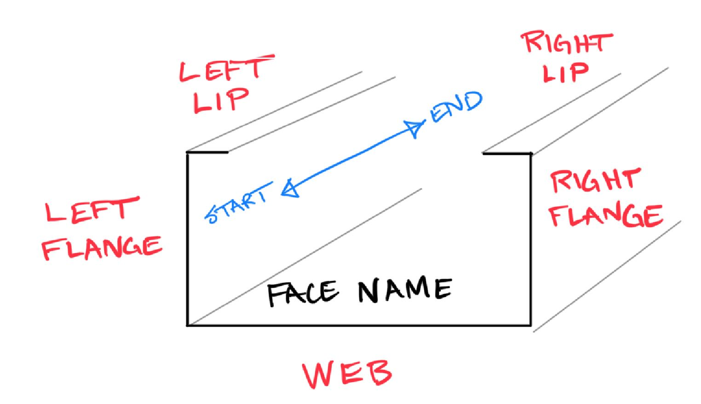

# Stud Operation

 Stud Operations are operations that Stud Machines perform at specific locations on a Stud Member. Stud Operations consist of (1) a location on the Member to which they belong and (2) a Stud Operation Type that is available on the Stud Machine that will fabricate the Member.

 
## Location
The Location of a Stud Operation is simply the distance from the start of the Member Axis to the center point of the Operation.

## Stud Operation Type
A Stud Operation Type corresponds to a punch or operation on a Stud Machine. Most punches have a defined shape (or shapes) that gets punched (removed) from the material as it is being formed into the shape of the stud. A few Operations perform other actions on a stud, besides punching, such as a Swage, which deforms the web of a stud in order to slightly shrink its width.

### Fabrication Name
Stud roll forming machines have specific names associated with each of their operations. StudFinder uses the Fabrication Name of a Stud Operation Type when exporting, so that fabrication files have the exact name a machine is expecting.

### Name
Sometimes operations that are geometrically and functionally identical have different Fabrication Names from machine to machine. However, they are referred to colloquially by a generally known Name. Except during export for fabrication, StudFinder works with the Name (as opposed to the Fabrication Name) of a Stud Operation Type in order to apply operations/details generally without needing to worry about the exact Fabrication Name at design time. Don't worry, StudFinder will automatically use the Fabrication Name when you go to fabrication.

### Shapes
An operation may include one or several Shapes that get punched out of the stud, or that represent some other action of the Stud Operation Type (the shapes for Swage, for example, are lines that represent where the stud will be shrunk). In StudFinder, each Stud Operation Shape objects include a Curve representing the geometry of the Shape and a Face Name and Face Location that are used to identify the placement of the Shape on the Stud profile.

__Face Name__

Face Name is represented by an enum that includes values for the Web, Left and Right Flange, and Left and Right Lip. "Left" and "Right" are based on looking at the stud profile from the start of the stud and toward the end.

__Face Location__

The center of each face is Location 0 (most punches are located at 0 on a face). From there, right/up are typically positive and left/down are typically negative. The exception to these rules is the Left Lip, which is organized as a mirror of the Right Lip in order to simplify calculation of operations (which tend to be mirrored).

