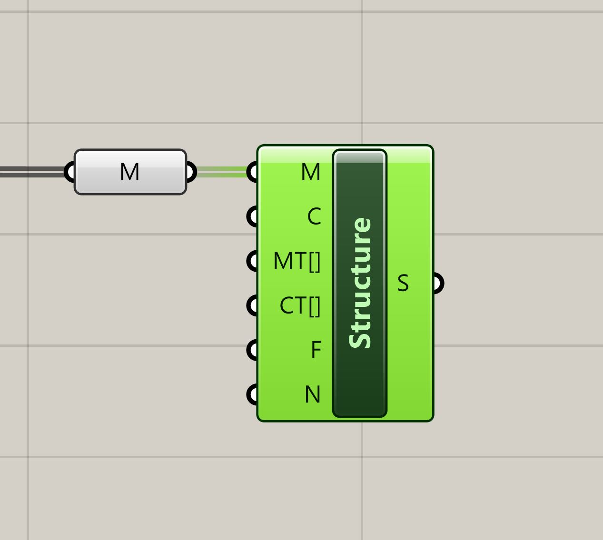
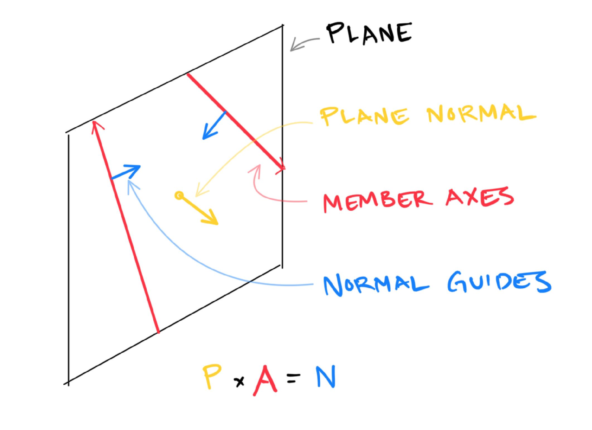
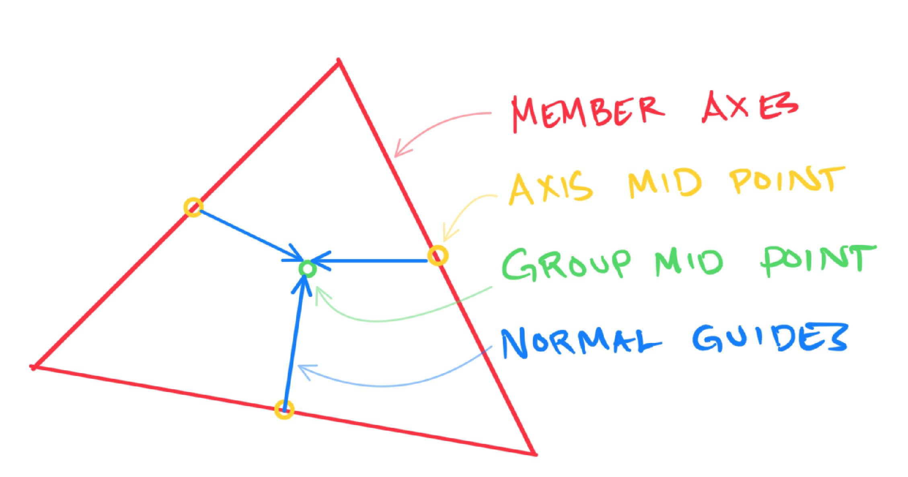

# StudFinder Grasshopper
Using StudFinder in Grasshoper allows you to set up custom, automated workflows to generate fabricatable models. Working parametrically requires a slightly different approach than designing StudFinder models directly ("manually") in a 3D modeling environment. This page walks you through how to think about setting up your StudFinder workflow in Grasshopper.

### Entry Points
There are two main entry points/approaches to generating StudFinder models in Grasshopper: 
- Member Based 
    - This is a more fundamental approach where you explicitly provide the analytical linework of your members/system.
- Region Based
    - With Regions, you work at a higher level, providing the 2D Regions that StudFinder will automatically populate with StudFinder Objects (Members, Connections, etc.).

## Member Based

The "Create Structure" component is the focal point of a Member based approach. You will feed your Members (and optionally Connections, Assemblies, Types, and other StudFinder Objects) into this component, and it will "Solve" the constrained properties of the Objects. Constrained properties include Member Normal, Member Type, and Connection Type.

## Create Members
Use the "Create Member" component to set up Members that StudFinder will ultimately combine/solve into a Structure. At a minimum, you must provide the axis (curve) of each Member. You may also want to provide a Name and Priority for your Member. In addition to these basic Member properties, you may want to provide "Guides" that the Solver will take into account when assigning values to constrained properties. 

### Normal Guide 
Providing a Normal Guide for a Member is particularly important. The solver will prioritize potential Normal vectors based on their similarity to the Normal Guide vector you provide. The Guide does not need to be precise; it just needs to point roughly in the direction you would prefer for the Member Normal. Here are a few patterns that are helpful to quickly generate rough Normal Guides.

If you created your Member Axis on a specific plane, you can use the normal of that plane directly as the guide (if you want the member normal facing in or out of that plane), or you can use the plane normal indirectly by taking the cross product of the plane normal with the Member Axis (if it is a Line) which results in a Normal Guide lying on the plane.

If you are creating a collection of Members, you may be able to use the centroid of your Member Axes to generate Normal Guide vectors. An easy way to do this is create a vector for each Axis, from the mid point of the Axis to the group centroid (which could be the "average" of all Axis mid points, for example).

### Member Type Guide

## Create Connections

## Create Assemblies

## Supply Types
